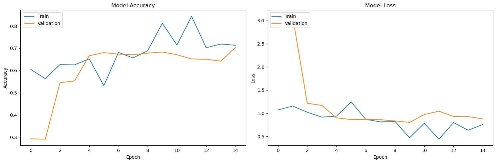

# Flower Classification with a CNN, Regularisation and Transfer Learning, plus a Transformer Block

Two-part deep-learning project in **TensorFlow / Keras**.

## Part 1: image classification (5 flower classes)
- Data: 3,457 training and 860 validation images (daisy, dandelion, rose, sunflower, tulip), split with `split-folders`, 224x224x3 input, augmentation.
- **Custom CNN** designed and trained for up to 20 epochs with early stopping.
- **Regularisation study**: L2 weight decay vs Batch Normalisation, compared on the same architecture.
- **Improvement step**: transfer learning with a pre-trained **ResNet50** backbone.

## Part 2: Transformer
- Hand-built **Transformer encoder block** (multi-head self-attention + feed-forward): 12 heads, model dim 768, 64-dim heads, feed-forward width 3,072; output shape verified `(2, 50, 768)`.
- Architecture and self-attention diagrams generated programmatically.

## Results
| Model | Validation accuracy |
|---|---|
| Custom CNN | about 0.70 (epoch 15 of 20) |
| CNN + BatchNorm | 0.666 (val. loss 0.927) |

**Known issue (honest note).** The scikit-learn classification report and confusion matrix in the notebook show about 0.22 accuracy (chance level for 5 classes), which contradicts the Keras validation accuracy. This is most likely an evaluation bug (predictions compared against labels from a *shuffled* validation generator), not a true test score. Fixing it would mean creating the validation generator with `shuffle=False`; I left the original outputs in place rather than hide it. A single-image prediction from a personal photo was also removed from the committed notebook.

## Skills demonstrated
TensorFlow/Keras, CNN design, data augmentation, regularisation (L2, BatchNorm), transfer learning, early stopping, Transformer / self-attention implementation, model evaluation and critical analysis.

## Run
`pip install -r requirements.txt`; the flower dataset is not included (see the notebook for the folder layout expected). GPU recommended.

## Context
Built as an individual assignment for the MSc in Artificial Intelligence & Machine Learning at the University of Adelaide (Concepts in AI & ML, 2025). Assignment brief text embedded in the notebook is the course's; the implementation and write-up are my own.

## Licence
MIT. See [LICENSE](LICENSE).
